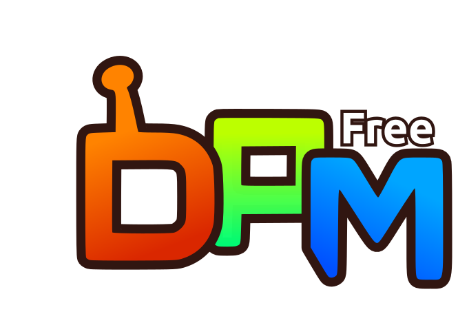
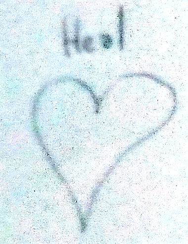
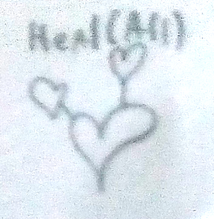
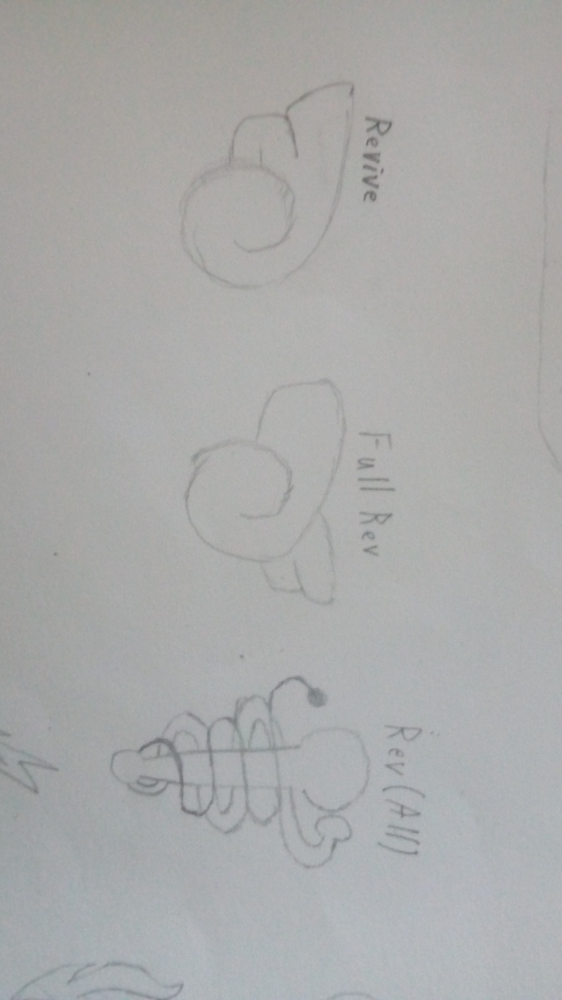
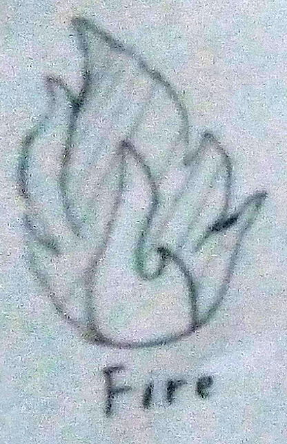
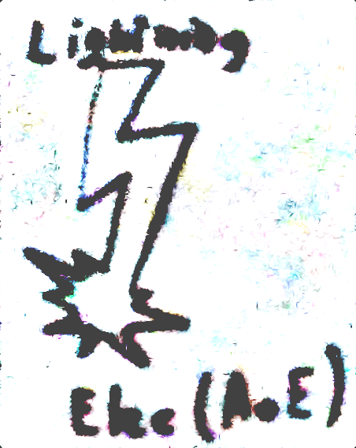
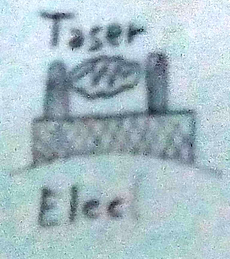
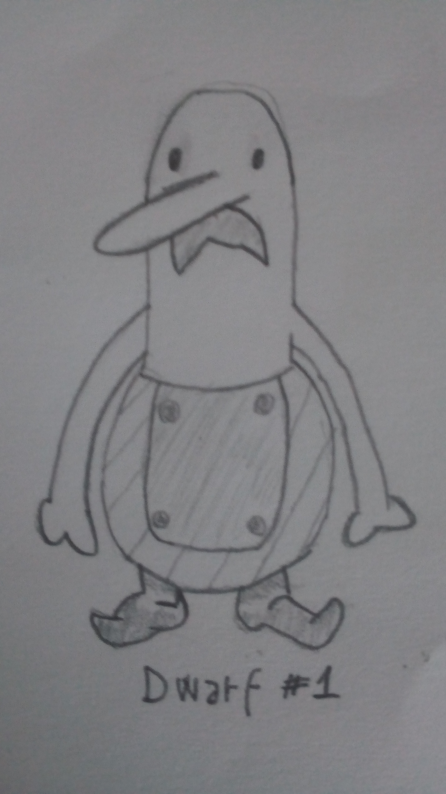

# 

_FreeDPM is a project that aims to create a standalone, open-source replacement of the "Denpa Men, The" Series's games, so that its charm may be felt on modern platforms. It started in 2018 along side [Project-Hope](https://envyniv.github.io/Project-Hope) as denparpg, but stagnated until 2022;_

_Its previous names were: denparpg, Open Denpa and, in conclusion, FreeDPM_

# Footage

13/02/2022 - Early Indev

# TODO

- [ ] Allow shooting at nothing in the Antenna Tower
- [X] Save file

--------------------------------------------------------------------------------

# About the game

the following is an encyclopedic collection on all creatues, items, concepts and antennae conceived for the game.

## Antennae

### Status Affecting (Buffs, Debuffs, Cures)

## Heals

### Heal

Heals selected for 25% of their max health;

At LV. 15 will upgrade to Medium Heal, which heals 50%.

At LV. 30 will upgrade to Full Heal, which heals 100%.

At LV. 75 will upgrade to Heal (All), which fully heals every party member.

 

### Revive

Brings back downed members, heals up to 50%; At LV. 30, will upgrade to Full Revive, which revives and heals completely. At LV. 75, will upgrade to its "All" variant, which revives all party members but initially heals up to 60%, but the more levels the denpa has, the more it will heal, up to 100%

## Attacks

### Fire

#### Combust

A flame spontaenously bursts on a selected enemy.

 

### Electricity

#### Bolt

Deals electricity damage to selected enemy and those right beside them.

 

#### Shock

Deals electricity damage to selected enemy and those right beside them.

 

--------------------------------------------------------------------------------

## Creatures

### Friendlies

#### Dwarves

They're back. Our favourite Broken english speaking dummies are back.  <!--   -->

### Monsters

#### Bosses

--------------------------------------------------------------------------------

## Items

### Equippables

### Consumables
